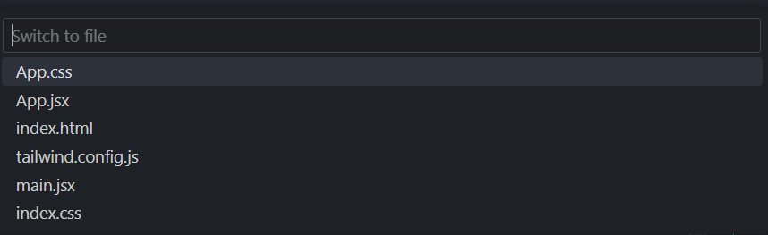

# Switch to Buffer 

This extension allows you to switch between buffers in the current workspace. It is similar to the `switch-to-buffer` command in emacs.
## Features

It iterates over all the open tabs in the current workspace and displays them in a list. You can then select the buffer you want to switch to.

## Extension Settings

For this extension to work, you need to just install it and call the Switch Files command that is available in the command palette.
I suggest you bind it to a key combination of your choice.

## Known Issues

For some reason, the extension may show hidden files in the list. I am working on fixing this issue.

## Release Notes

### 1.0.0

Initial release of switchbuffers